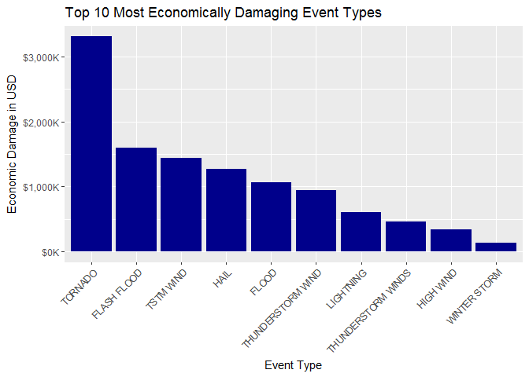
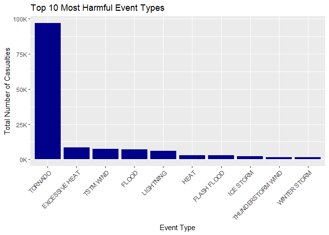

# Most Devastating Natural Events


## Abstract

The National Oceanic and Atmospheric Administration (NOAA) documents and tracks storm data, unusual weather patterns, and other significant weather events. The purpose of this document is to analyze the data to identify the most damaging storm or weather event types. After a top-level analysis of the data, tornados have caused more economic damage and contributed to more human casualties than any other event type.

## Data Analysis

First we will read the data file downloaded from NOAA, and then inspect the data that we have.


```r
Storm <- read.csv("StormData.csv.bz2")
str(Storm)
```

```
## 'data.frame':	902297 obs. of  37 variables:
##  $ STATE__   : num  1 1 1 1 1 1 1 1 1 1 ...
##  $ BGN_DATE  : Factor w/ 16335 levels "1/1/1966 0:00:00",..: 6523 6523 4242 11116 2224 2224 2260 383 3980 3980 ...
##  $ BGN_TIME  : Factor w/ 3608 levels "00:00:00 AM",..: 272 287 2705 1683 2584 3186 242 1683 3186 3186 ...
##  $ TIME_ZONE : Factor w/ 22 levels "ADT","AKS","AST",..: 7 7 7 7 7 7 7 7 7 7 ...
##  $ COUNTY    : num  97 3 57 89 43 77 9 123 125 57 ...
##  $ COUNTYNAME: Factor w/ 29601 levels "","5NM E OF MACKINAC BRIDGE TO PRESQUE ISLE LT MI",..: 13513 1873 4598 10592 4372 10094 1973 23873 24418 4598 ...
##  $ STATE     : Factor w/ 72 levels "AK","AL","AM",..: 2 2 2 2 2 2 2 2 2 2 ...
##  $ EVTYPE    : Factor w/ 985 levels "   HIGH SURF ADVISORY",..: 834 834 834 834 834 834 834 834 834 834 ...
##  $ BGN_RANGE : num  0 0 0 0 0 0 0 0 0 0 ...
##  $ BGN_AZI   : Factor w/ 35 levels "","  N"," NW",..: 1 1 1 1 1 1 1 1 1 1 ...
##  $ BGN_LOCATI: Factor w/ 54429 levels "","- 1 N Albion",..: 1 1 1 1 1 1 1 1 1 1 ...
##  $ END_DATE  : Factor w/ 6663 levels "","1/1/1993 0:00:00",..: 1 1 1 1 1 1 1 1 1 1 ...
##  $ END_TIME  : Factor w/ 3647 levels ""," 0900CST",..: 1 1 1 1 1 1 1 1 1 1 ...
##  $ COUNTY_END: num  0 0 0 0 0 0 0 0 0 0 ...
##  $ COUNTYENDN: logi  NA NA NA NA NA NA ...
##  $ END_RANGE : num  0 0 0 0 0 0 0 0 0 0 ...
##  $ END_AZI   : Factor w/ 24 levels "","E","ENE","ESE",..: 1 1 1 1 1 1 1 1 1 1 ...
##  $ END_LOCATI: Factor w/ 34506 levels "","- .5 NNW",..: 1 1 1 1 1 1 1 1 1 1 ...
##  $ LENGTH    : num  14 2 0.1 0 0 1.5 1.5 0 3.3 2.3 ...
##  $ WIDTH     : num  100 150 123 100 150 177 33 33 100 100 ...
##  $ F         : int  3 2 2 2 2 2 2 1 3 3 ...
##  $ MAG       : num  0 0 0 0 0 0 0 0 0 0 ...
##  $ FATALITIES: num  0 0 0 0 0 0 0 0 1 0 ...
##  $ INJURIES  : num  15 0 2 2 2 6 1 0 14 0 ...
##  $ PROPDMG   : num  25 2.5 25 2.5 2.5 2.5 2.5 2.5 25 25 ...
##  $ PROPDMGEXP: Factor w/ 19 levels "","-","?","+",..: 17 17 17 17 17 17 17 17 17 17 ...
##  $ CROPDMG   : num  0 0 0 0 0 0 0 0 0 0 ...
##  $ CROPDMGEXP: Factor w/ 9 levels "","?","0","2",..: 1 1 1 1 1 1 1 1 1 1 ...
##  $ WFO       : Factor w/ 542 levels ""," CI","$AC",..: 1 1 1 1 1 1 1 1 1 1 ...
##  $ STATEOFFIC: Factor w/ 250 levels "","ALABAMA, Central",..: 1 1 1 1 1 1 1 1 1 1 ...
##  $ ZONENAMES : Factor w/ 25112 levels "","                                                                                                               "| __truncated__,..: 1 1 1 1 1 1 1 1 1 1 ...
##  $ LATITUDE  : num  3040 3042 3340 3458 3412 ...
##  $ LONGITUDE : num  8812 8755 8742 8626 8642 ...
##  $ LATITUDE_E: num  3051 0 0 0 0 ...
##  $ LONGITUDE_: num  8806 0 0 0 0 ...
##  $ REMARKS   : Factor w/ 436781 levels "","-2 at Deer Park\n",..: 1 1 1 1 1 1 1 1 1 1 ...
##  $ REFNUM    : num  1 2 3 4 5 6 7 8 9 10 ...
```

For the purpose of identifying the most damaging weather event (EVTYPE), I see there are variables in the raw data for injuries, fatalities, crop damage, and property damage. 

### Data Transformations  
We can combine injuries and fatalities to produce a variable for total casualties, and crop damage plus property damage will produce total economic impact.

```r
Storm$CASUALTIES <- Storm$FATALITIES + Storm$INJURIES
Storm$ECONDMG <- Storm$PROPDMG + Storm$CROPDMG
```

## Results

For plotting the effect variables against the event type, we'll need to load some packages:

Also note that because there are 995 different types of events in the EVTYPE variable, I only want to report on the top most damaging events.


```r
econ.sum <- aggregate(Storm$ECONDMG, 
                      by=list(Storm$EVTYPE), 
                      FUN=sum, na.rm=T)
econ.sum <- econ.sum[order(econ.sum$x,decreasing = TRUE),]
econ.sum$x <- econ.sum$x / 1000
econ.sum$Group.1 <- factor(econ.sum$Group.1, levels = econ.sum$Group.1[order(econ.sum$x, decreasing = TRUE)])

qplot(Group.1, data=econ.sum[1:10,], 
      geom="bar", weight=x, fill=I("darkblue")) + 
    ggtitle("Top 10 Most Economically Damaging Event Types") +
    xlab("Event Type") +
    theme(axis.text.x=element_text(angle=45,hjust=1)) +
    scale_y_continuous("Economic Damage in USD",
                       label=dollar_format(prefix="$",suffix="K"))
```



Over the course of the data collection, tornados have caused $3.3 million in damages to crops and property. This is more than double the next most devastating event, flash floods, causing $1.6 million in damages.  


```r
casl.sum <- aggregate(Storm$CASUALTIES, 
                      by=list(Storm$EVTYPE), 
                      FUN=sum, na.rm=T)
casl.sum <- casl.sum[order(casl.sum$x,decreasing = TRUE),]
casl.sum$x <- casl.sum$x / 1000
casl.sum$Group.1 <- factor(casl.sum$Group.1, levels=casl.sum$Group.1[order(casl.sum$x,decreasing = TRUE)])
qplot(Group.1, data=casl.sum[1:10,],
      geom="bar", weight=x, fill=I("darkblue")) + 
    ggtitle("Top 10 Most Harmful Event Types") +
    xlab("Event Type") +
    theme(axis.text.x=element_text(angle=45,hjust=1)) +
    scale_y_continuous("Total Number of Casualties",
                       label=dollar_format(prefix="",suffix="K"))
```



When it comes to human casualties, tornados again are the most devasting, having caused 97,000 casualties during the course of data collection. The next most harmful weather pattern is excessive heat, causing just over 8,000 casualties.  

## Conclusion  
When looking at events at a top level, tornados are the most devastating in terms of economic damage and human casualties. Of course, these metrics could be influenced by the number of times the event occurs in addition to the danger posed by the event. Future analyses could focus on expected damage from a single event to determine which single event could be most devastating. Certainly tornados would make the list, but perhaps hurricanes would prove to be more dangerous.
